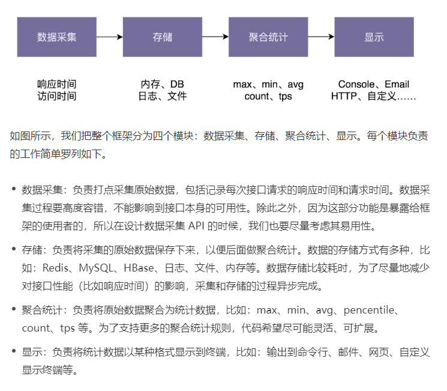

# 设计原则理论

## 职责单一原则

**1. 如何理解单一职责原则（SRP）？**

一个类只负责完成一个职责或者功能。不要设计大而全的类，要设计粒度小、功能单一的类。单一职责原则是为了实现代码高内聚、低耦合，提高代码的复用性、可读性、可维护性。

**2. 如何判断类的职责是否足够单一？**

不同的应用场景、不同阶段的需求背景、不同的业务层面，对同一个类的职责是否单一，可能会有不同的判定结果。实际上，一些侧面的判断指标更具有指导意义和可执行性，比如，出现下面这些情况就有可能说明这类的设计不满足单一职责原则：

类中的代码行数、函数或者属性过多；

类依赖的其他类过多，或者依赖类的其他类过多；

私有方法过多；

比较难给类起一个合适的名字；

类中大量的方法都是集中操作类中的某几个属性。

**3. 类的职责是否设计得越单一越好？**

单一职责原则通过避免设计大而全的类，避免将不相关的功能耦合在一起，来提高类的内聚性。同时，类职责单一，类依赖的和被依赖的其他类也会变少，减少了代码的耦合性，以此来实现代码的高内聚、低耦合。但是，如果拆分得过细，实际上会适得其反，反倒会降低内聚性，也会影响代码的可维护性。

## 开闭原则

**1. 如何理解“对扩展开放、对修改关闭”？**

添加一个新的功能，应该是通过在已有代码基础上扩展代码（新增模块、类、方法、属性等），而非修改已有代码（修改模块、类、方法、属性等）的方式来完成。关于定义，我们有两点要注意。第一点是，开闭原则并不是说完全杜绝修改，而是以最小的修改代码的代价来完成新功能的开发。第二点是，同样的代码改动，在粗代码粒度下，可能被认定为“修改”；在细代码粒度下，可能又被认定为“扩展”。

**2. 如何做到“对扩展开放、修改关闭”？**

我们要时刻具备扩展意识、抽象意识、封装意识。在写代码的时候，我们要多花点时间思考一下，这段代码未来可能有哪些需求变更，如何设计代码结构，事先留好扩展点，以便在未来需求变更的时候，在不改动代码整体结构、做到最小代码改动的情况下，将新的代码灵活地插入到扩展点上。

很多设计原则、设计思想、设计模式，都是以提高代码的扩展性为最终目的的。特别是 23 种经典设计模式，大部分都是为了解决代码的扩展性问题而总结出来的，都是以开闭原则为指导原则的。最常用来提高代码扩展性的方法有：多态、依赖注入、基于接口而非实现编程，以及大部分的设计模式（比如，装饰、策略、模板、职责链、状态）

## 里式替换原则

里式替换（LSP）

里式替换原则是用来指导，继承关系中子类该如何设计的一个原则。理解里式替换原则，最核心的就是理解“design by contract，按照协议来设计”这几个字。父类定义了函数的“约定”（或者叫协议），那子类可以改变函数的内部实现逻辑，但不能改变函数原有的“约定”。这里的约定包括：函数声明要实现的功能；对输入、输出、异常的约定；甚至包括注释中所罗列的任何特殊说明。

理解这个原则，我们还要弄明白里式替换原则跟多态的区别。虽然从定义描述和代码实现上来看，多态和里式替换有点类似，但它们关注的角度是不一样的。多态是面向对象编程的一大特性，也是面向对象编程语言的一种语法。它是一种代码实现的思路。而里式替换是一种设计原则，用来指导继承关系中子类该如何设计，子类的设计要保证在替换父类的时候，不改变原有程序的逻辑及不破坏原有程序的正确性

## **接口隔离原则**

**1. 如何理解“接口隔离原则”？**

理解“接口隔离原则”的重点是理解其中的“接口”二字。这里有三种不同的理解。

如果把“接口”理解为一组接口集合，可以是某个微服务的接口，也可以是某个类库的接口等。如果部分接口只被部分调用者使用，我们就需要将这部分接口隔离出来，单独给这部分调用者使用，而不强迫其他调用者也依赖这部分不会被用到的接口。

如果把“接口”理解为单个 API 接口或函数，部分调用者只需要函数中的部分功能，那我们就需要把函数拆分成粒度更细的多个函数，让调用者只依赖它需要的那个细粒度函数。

如果把“接口”理解为 OOP 中的接口，也可以理解为面向对象编程语言中的接口语法。那接口的设计要尽量单一，不要让接口的实现类和调用者，依赖不需要的接口函数。

**2. 接口隔离原则与单一职责原则的区别**

单一职责原则针对的是模块、类、接口的设计。接口隔离原则相对于单一职责原则，一方面更侧重于接口的设计，另一方面它的思考角度也是不同的。接口隔离原则提供了一种判断接口的职责是否单一的标准：通过调用者如何使用接口来间接地判定。如果调用者只使用部分接口或接口的部分功能，那接口的设计就不够职责单一

## IOC与DI原则

**1. 控制反转**

实际上，控制反转是一个比较笼统的设计思想，并不是一种具体的实现方法，一般用来指导框架层面的设计。这里所说的“控制”指的是对程序执行流程的控制，而“反转”指的是在没有使用框架之前，程序员自己控制整个程序的执行。在使用框架之后，整个程序的执行流程通过框架来控制。流程的控制权从程序员“反转”给了框架。

**2. 依赖注入**

依赖注入和控制反转恰恰相反，它是一种具体的编码技巧。我们不通过 new 的方式在类内部创建依赖类的对象，而是将依赖的类对象在外部创建好之后，通过构造函数、函数参数等方式传递（或注入）给类来使用。

**3. 依赖注入框架**

我们通过依赖注入框架提供的扩展点，简单配置一下所有需要的类及其类与类之间依赖关系，就可以实现由框架来自动创建对象、管理对象的生命周期、依赖注入等原本需要程序员来做的事情。

**4. 依赖反转原则**

依赖反转原则也叫作依赖倒置原则。这条原则跟控制反转有点类似，主要用来指导框架层面的设计。高层模块不依赖低层模块，它们共同依赖同一个抽象。抽象不要依赖具体实现细节，具体实现细节依赖抽象

## KISS和YAGNI 原则

KISS 原则是保持代码可读和可维护的重要手段。KISS 原则中的“简单”并不是以代码行数来考量的。代码行数越少并不代表代码越简单，我们还要考虑逻辑复杂度、实现难度、代码的可读性等。而且，本身就复杂的问题，用复杂的方法解决，并不违背 KISS 原则。除此之外，同样的代码，在某个业务场景下满足 KISS 原则，换一个应用场景可能就不满足了。

对于如何写出满足 KISS 原则的代码，我还总结了下面几条指导原则：

不要使用同事可能不懂的技术来实现代码；

不要重复造轮子，要善于使用已经有的工具类库；

不要过度优化

YAGNI 原则的英文全称是：You Ain’t Gonna Need It。直译就是：你不会需要它。这条原则也算是万金油了。当用在软件开发中的时候，它的意思是：不要去设计当前用不到的功能；不要去编写当前用不到的代码。实际上，这条原则的核心思想就是：不要做过度设计。

比如，我们的系统暂时只用 Redis 存储配置信息，以后可能会用到 ZooKeeper。根据 YAGNI 原则，在未用到 ZooKeeper 之前，我们没必要提前编写这部分代码。当然，这并不是说我们就不需要考虑代码的扩展性。我们还是要预留好扩展点，等到需要的时候，再去实现 ZooKeeper 存储配置信息这部分代码。

再比如，我们不要在项目中提前引入不需要依赖的开发包。对于 Java 程序员来说，我们经常使用 Maven 或者 Gradle 来管理依赖的类库（library）。我发现，有些同事为了避免开发中 library 包缺失而频繁地修改 Maven 或者 Gradle 配置文件，提前往项目里引入大量常用的 library 包。实际上，这样的做法也是违背 YAGNI 原则的。

从刚刚的分析我们可以看出，YAGNI 原则跟 KISS 原则并非一回事儿。KISS 原则讲的是“如何做”的问题（尽量保持简单），而 YAGNI 原则说的是“要不要做”的问题（当前不需要的就不要做）。

## 复用原则

**1.DRY 原则**

我们今天讲了三种代码重复的情况：实现逻辑重复、功能语义重复、代码执行重复。实现逻辑重复，但功能语义不重复的代码，并不违反 DRY 原则。实现逻辑不重复，但功能语义重复的代码，也算是违反 DRY 原则。除此之外，代码执行重复也算是违反 DRY 原则。

**2. 代码复用性**

今天，我们讲到提高代码可复用性的一些方法，有以下 7 点。

减少代码耦合

满足单一职责原则

模块化

业务与非业务逻辑分离

通用代码下沉

继承、多态、抽象、封装

应用模板等设计模式

实际上，除了上面讲到的这些方法之外，复用意识也非常重要。在设计每个模块、类、函数的时候，要像设计一个外部 API 一样去思考它的复用性。

我们在第一次写代码的时候，如果当下没有复用的需求，而未来的复用需求也不是特别明确，并且开发可复用代码的成本比较高，那我们就不需要考虑代码的复用性。在之后开发新的功能的时候，发现可以复用之前写的这段代码，那我们就重构这段代码，让其变得更加可复用。

相比于代码的可复用性，DRY 原则适用性更强一些。我们可以不写可复用的代码，但一定不能写重复的代码

## 最小知识原则

即迪米特原则，“高内聚”用来指导类本身的设计，“松耦合”用来指导类与类之间依赖关系的设计。不过，这两者并非完全独立不相干。高内聚有助于松耦合，松耦合又需要高内聚的支持。

不该有直接依赖关系的类之间，不要有依赖；有依赖关系的类之间，尽量只依赖必要的接口（也就是定义中的“有限知识”）

**1. 如何理解“高内聚、松耦合”？**

“高内聚、松耦合”是一个非常重要的设计思想，能够有效提高代码的可读性和可维护性，缩小功能改动导致的代码改动范围。“高内聚”用来指导类本身的设计，“松耦合”用来指导类与类之间依赖关系的设计。

所谓高内聚，就是指相近的功能应该放到同一个类中，不相近的功能不要放到同一类中。相近的功能往往会被同时修改，放到同一个类中，修改会比较集中。所谓松耦合指的是，在代码中，类与类之间的依赖关系简单清晰。即使两个类有依赖关系，一个类的代码改动也不会或者很少导致依赖类的代码改动。

**2. 如何理解“迪米特法则”？**

不该有直接依赖关系的类之间，不要有依赖；有依赖关系的类之间，尽量只依赖必要的接口。迪米特法则是希望减少类之间的耦合，让类越独立越好。每个类都应该少了解系统的其他部分。一旦发生变化，需要了解这一变化的类就会比较少。

# 案例分享

## 系统分层

**1. 为什么要分 MVC 三层开发？**

对于这个问题，我总结了以下 5 点原因。

分层能起到代码复用的作用

分层能起到隔离变化的作用

分层能起到隔离关注点的作用

分层能提高代码的可测试性

分层能应对系统的复杂性

**2.BO、VO、Entity 存在的意义是什么？**

从设计的角度来说，VO、BO、Entity 的设计思路并不违反 DRY 原则，为了分层清晰、减少耦合，多维护几个类的成本也并不是不能接受的。但是，如果你真的有代码洁癖，对于代码重复的问题，我们可以通过继承或者组合来解决。

如何进行数据对象之间的转化？最简单的方式就是手动复制。当然，你也可以使用 Java 中提供了数据对象转化工具，比如 BeanUtils、Dozer 等，可以大大简化繁琐的对象转化工作。

尽管 VO、BO、Entity 的设计违背 OOP 的封装特性，有被随意修改的风险。但 Entity 和 VO 的生命周期是有限的，都仅限在本层范围内，相对来说是安全的。Service 层包含比较多的业务逻辑代码，所以 BO 就存在被任意修改的风险了。为了使用方便，我们只能做一些妥协，放弃 BO 的封装特性，由程序员自己来负责这些数据对象的不被错误使用。

**3. 总结用到的设计原则和思想**

从表面上看，做业务开发可能并不是特别有技术挑战，但是实际上，如果你要做到知其然知其所以然，做到透彻理解、真的懂，并不是件容易的事情。深挖一下，你会发现这其中还是蕴含了很多设计原则、思想和模式的

## 监控统计

 

Review：

我们前面讲到了 SOLID、KISS、DRY、YAGNI、LOD 等设计原则，基于接口而非实现编程、多用组合少用继承、高内聚低耦合等设计思想。我们现在就来看下，上面的代码实现是否符合这些设计原则和思想。

MetricsCollector

MetricsCollector 负责采集和存储数据，职责相对来说还算比较单一。它基于接口而非实现编程，通过依赖注入的方式来传递 MetricsStorage 对象，可以在不需要修改代码的情况下，灵活地替换不同的存储方式，满足开闭原则。

MetricsStorage、RedisMetricsStorage

MetricsStorage 和 RedisMetricsStorage 的设计比较简单。当我们需要实现新的存储方式的时候，只需要实现 MetricsStorage 接口即可。因为所有用到 MetricsStorage 和 RedisMetricsStorage 的地方，都是基于相同的接口函数来编程的，所以，除了在组装类的地方有所改动（从 RedisMetricsStorage 改为新的存储实现类），其他接口函数调用的地方都不需要改动，满足开闭原则。

Aggregator

Aggregator 类是一个工具类，里面只有一个静态函数，有 50 行左右的代码量，负责各种统计数据的计算。当需要扩展新的统计功能的时候，需要修改 aggregate() 函数代码，并且一旦越来越多的统计功能添加进来之后，这个函数的代码量会持续增加，可读性、可维护性就变差了。所以，从刚刚的分析来看，这个类的设计可能存在职责不够单一、不易扩展等问题，需要在之后的版本中，对其结构做优化。

ConsoleReporter、EmailReporter

ConsoleReporter 和 EmailReporter 中存在代码重复问题。在这两个类中，从数据库中取数据、做统计的逻辑都是相同的，可以抽取出来复用，否则就违反了 DRY 原则。而且整个类负责的事情比较多，职责不是太单一。特别是显示部分的代码，可能会比较复杂（比如 Email 的展示方式），最好是将显示部分的代码逻辑拆分成独立的类。除此之外，因为代码中涉及线程操作，并且调用了 Aggregator 的静态函数，所以代码的可测试性不好。