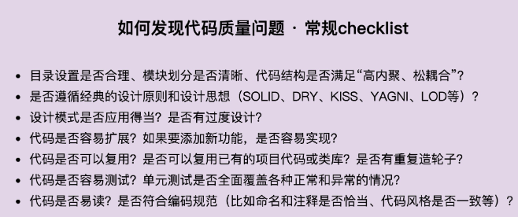
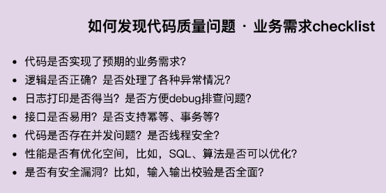
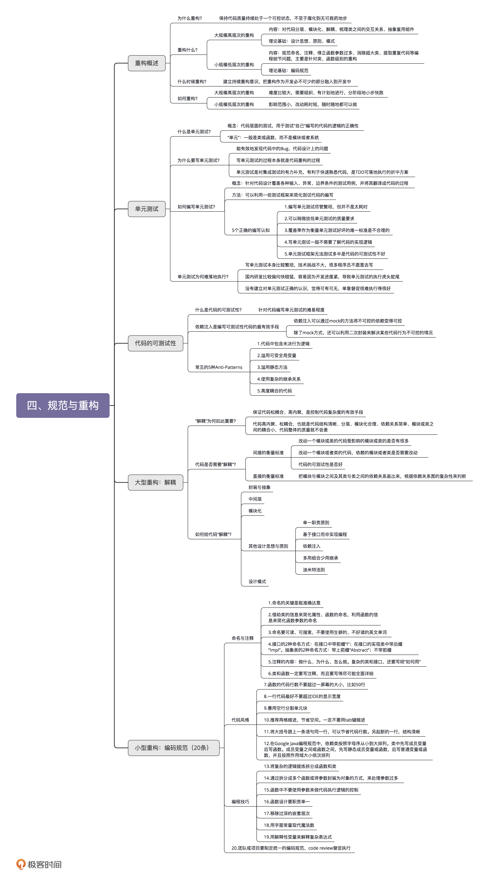

# 理论

## 代码重构目标

**1. 重构的目的：为什么重构（why）？**

对于项目来言，重构可以保持代码质量持续处于一个可控状态，不至于腐化到无可救药的地步。对于个人而言，重构非常锻炼一个人的代码能力，并且是一件非常有成就感的事情。它是我们学习的经典设计思想、原则、模式、编程规范等理论知识的练兵场。

**2. 重构的对象：重构什么（what）？**

按照重构的规模，我们可以将重构大致分为大规模高层次的重构和小规模低层次的重构。大规模高层次重构包括对代码分层、模块化、解耦、梳理类之间的交互关系、抽象复用组件等等。这部分工作利用的更多的是比较抽象、比较顶层的设计思想、原则、模式。小规模低层次的重构包括规范命名、注释、修正函数参数过多、消除超大类、提取重复代码等等编程细节问题，主要是针对类、函数级别的重构。小规模低层次的重构更多的是利用编码规范这一理论知识。

**3. 重构的时机：什么时候重构（when）？**

我反复强调，我们一定要建立持续重构意识，把重构作为开发必不可少的部分，融入到日常开发中，而不是等到代码出现很大问题的时候，再大刀阔斧地重构。

**4. 重构的方法：如何重构（how）？**

大规模高层次的重构难度比较大，需要组织、有计划地进行，分阶段地小步快跑，时刻让代码处于一个可运行的状态。而小规模低层次的重构，因为影响范围小，改动耗时短，所以，只要你愿意并且有时间，随时随地都可以去做。


## 编写单元测试

**1. 什么是单元测试？**

单元测试是代码层面的测试，由研发自己来编写，用于测试“自己”编写的代码的逻辑的正确性。单元测试顾名思义是测试一个“单元”，有别于集成测试，这个“单元”一般是类或函数，而不是模块或者系统。

**2. 为什么要写单元测试？**

写单元测试的过程本身就是代码 Code Review 和重构的过程，能有效地发现代码中的 bug 和代码设计上的问题。除此之外，单元测试还是对集成测试的有力补充，还能帮助我们快速熟悉代码，是 TDD 可落地执行的改进方案。

**3. 如何编写单元测试？**

写单元测试就是针对代码设计各种测试用例，以覆盖各种输入、异常、边界情况，并将其翻译成代码。我们可以利用一些测试框架来简化单元测试的编写。除此之外，对于单元测试，我们需要建立以下正确的认知：

编写单元测试尽管繁琐，但并不是太耗时；

我们可以稍微放低对单元测试代码质量的要求；

覆盖率作为衡量单元测试质量的唯一标准是不合理的；

单元测试不要依赖被测代码的具体实现逻辑；

单元测试框架无法测试，多半是因为代码的可测试性不好。

**4. 单元测试为何难落地执行？**

一方面，写单元测试本身比较繁琐，技术挑战不大，很多程序员不愿意去写；另一方面，国内研发比较偏向“快、糙、猛”，容易因为开发进度紧，导致单元测试的执行虎头蛇尾。最后，关键问题还是团队没有建立对单元测试正确的认识，觉得可有可无，单靠督促很难执行得很好。


## 代码可测试性

**1. 什么是代码的可测试性？**

粗略地讲，所谓代码的可测试性，就是针对代码编写单元测试的难易程度。对于一段代码，如果很难为其编写单元测试，或者单元测试写起来很费劲，需要依靠单元测试框架中很高级的特性，那往往就意味着代码设计得不够合理，代码的可测试性不好。

**2. 编写可测试性代码的最有效手段**

依赖注入是编写可测试性代码的最有效手段。通过依赖注入，我们在编写单元测试的时候，可以通过 mock 的方法解依赖外部服务，这也是我们在编写单元测试的过程中最有技术挑战的地方。

**3. 常见的 Anti-Patterns**

常见的测试不友好的代码有下面这 5 种：

代码中包含未决行为逻辑

滥用可变全局变量

滥用静态方法

使用复杂的继承关系

高度耦合的代码


## 解耦

**1.“解耦”为何如此重要？**

过于复杂的代码往往在可读性、可维护性上都不友好。解耦保证代码松耦合、高内聚，是控制代码复杂度的有效手段。代码高内聚、松耦合，也就是意味着，代码结构清晰、分层模块化合理、依赖关系简单、模块或类之间的耦合小，那代码整体的质量就不会差。

**2. 代码是否需要“解耦”？**

间接的衡量标准有很多，比如，看修改代码是否牵一发而动全身。直接的衡量标准是把模块与模块、类与类之间的依赖关系画出来，根据依赖关系图的复杂性来判断是否需要解耦重构。

**3. 如何给代码“解耦”？**

给代码解耦的方法有：封装与抽象、中间层、模块化，以及一些其他的设计思想与原则，比如：单一职责原则、基于接口而非实现编程、依赖注入、多用组合少用继承、迪米特法则等。当然，还有一些设计模式，比如观察者模式。


## 代码规范

**1. 关于命名**

命名的关键是能准确达意。对于不同作用域的命名，我们可以适当地选择不同的长度。作用域小的变量（比如临时变量），可以适当地选择短一些的命名方式。除此之外，命名中也可以使用一些耳熟能详的缩写。

我们可以借助类的信息来简化属性、函数的命名，利用函数的信息来简化函数参数的命名。

命名要可读、可搜索。不要使用生僻的、不好读的英文单词来命名。除此之外，命名要符合项目的统一规范，不要用些反直觉的命名。

接口有两种命名方式：一种是在接口中带前缀“I”；另一种是在接口的实现类中带后缀“Impl”。对于抽象类的命名，也有两种方式，一种是带上前缀“Abstract”，一种是不带前缀。这两种命名方式都可以，关键是要在项目中统一。

**2. 关于注释**

注释的目的就是让代码更容易看懂。只要符合这个要求的内容，你就可以将它写到注释里。总结一下，注释的内容主要包含这样三个方面：做什么、为什么、怎么做。对于一些复杂的类和接口，我们可能还需要写明“如何用”。

注释本身有一定的维护成本，所以并非越多越好。类和函数一定要写注释，而且要写得尽可能全面、详细，而函数内部的注释要相对少一些，一般都是靠好的命名、提炼函数、解释性变量、总结性注释来提高代码可读性

**3. 函数、类多大才合适？**

函数的代码行数不要超过一屏幕的大小，比如 50 行。类的大小限制比较难确定。

**4. 一行代码多长最合适？**

最好不要超过 IDE 显示的宽度。当然，限制也不能太小，太小会导致很多稍微长点的语句被折成两行，也会影响到代码的整洁，不利于阅读。

**5. 善用空行分割单元块**

对于比较长的函数，为了让逻辑更加清晰，可以使用空行来分割各个代码块。在类内部，成员变量与函数之间、静态成员变量与普通成员变量之间、函数之间，甚至成员变量之间，都可以通过添加空行的方式，让不同模块的代码之间的界限更加明确。

**6. 四格缩进还是两格缩进？**

我个人比较推荐使用两格缩进，这样可以节省空间，特别是在代码嵌套层次比较深的情况下。除此之外，值得强调的是，不管是用两格缩进还是四格缩进，一定不要用 tab 键缩进。

**7. 大括号是否要另起一行？**

我个人还是比较推荐将大括号放到跟上一条语句同一行的风格，这样可以节省代码行数。但是，将大括号另起一行，也有它的优势，那就是，左右括号可以垂直对齐，哪些代码属于哪一个代码块，更加一目了然。

**8. 类中成员的排列顺序**

在 Google Java 编程规范中，依赖类按照字母序从小到大排列。类中先写成员变量后写函数。成员变量之间或函数之间，先写静态成员变量或函数，后写普通变量或函数，并且按照作用域大小依次排列。

今天讲到所有的代码风格都没有对错和优劣之分，只要能在团队、项目中统一即可，不过，最好能跟业内推荐的风格、开源项目的代码风格相一致

**9. 关于命名**

命名的关键是能准确达意。对于不同作用域的命名，我们可以适当地选择不同的长度。

我们可以借助类的信息来简化属性、函数的命名，利用函数的信息来简化函数参数的命名。

命名要可读、可搜索。不要使用生僻的、不好读的英文单词来命名。命名要符合项目的统一规范，也不要用些反直觉的命名。

接口有两种命名方式：一种是在接口中带前缀“I”；另一种是在接口的实现类中带后缀“Impl”。对于抽象类的命名，也有两种方式，一种是带上前缀“Abstract”，一种是不带前缀。这两种命名方式都可以，关键是要在项目中统一。

**10. 关于注释**

注释的内容主要包含这样三个方面：做什么、为什么、怎么做。对于一些复杂的类和接口，我们可能还需要写明“如何用”。

类和函数一定要写注释，而且要写得尽可能全面详细。函数内部的注释要相对少一些，一般都是靠好的命名、提炼函数、解释性变量、总结性注释来提高代码可读性。

**11. 关于代码风格**

函数、类多大才合适？函数的代码行数不要超过一屏幕的大小，比如 50 行。类的大小限制比较难确定。

一行代码多长最合适？最好不要超过 IDE 的显示宽度。当然，也不能太小，否则会导致很多稍微长点的语句被折成两行，也会影响到代码的整洁，不利于阅读。

善用空行分割单元块。对于比较长的函数，为了让逻辑更加清晰，可以使用空行来分割各个代码块。

四格缩进还是两格缩进？我个人比较推荐使用两格缩进，这样可以节省空间，尤其是在代码嵌套层次比较深的情况下。不管是用两格缩进还是四格缩进，一定不要用 tab 键缩进。

大括号是否要另起一行？将大括号放到跟上一条语句同一行，可以节省代码行数。但是将大括号另起新的一行的方式，左右括号可以垂直对齐，哪些代码属于哪一个代码块，更加一目了然。

类中成员怎么排列？在 Google Java 编程规范中，依赖类按照字母序从小到大排列。类中先写成员变量后写函数。成员变量之间或函数之间，先写静态成员变量或函数，后写普通变量或函数，并且按照作用域大小依次排列。

**12. 关于编码技巧**

将复杂的逻辑提炼拆分成函数和类。

通过拆分成多个函数或将参数封装为对象的方式，来处理参数过多的情况。

函数中不要使用参数来做代码执行逻辑的控制。

函数设计要职责单一。

移除过深的嵌套层次，方法包括：去掉多余的 if 或 else 语句，使用 continue、break、return 关键字提前退出嵌套，调整执行顺序来减少嵌套，将部分嵌套逻辑抽象成函数。

用字面常量取代魔法数。

用解释性变量来解释复杂表达式，以此提高代码可读性。

**13. 统一编码规范**

除了这三节讲到的比较细节的知识点之外，最后，还有一条非常重要的，那就是，项目、团队，甚至公司，一定要制定统一的编码规范，并且通过 Code Review 督促执行，这对提高代码质量有立竿见影的效果。

# 案例

## id生成器

### 问题代码：

```
public class IdGenerator {
  private static final Logger logger = LoggerFactory.getLogger(IdGenerator.class);
  public static String generate() {
    String id = "";
    try {
      String hostName = InetAddress.getLocalHost().getHostName();
      String[] tokens = hostName.split("\\.");
      if (tokens.length > 0) {
        hostName = tokens[tokens.length - 1];
      }
      char[] randomChars = new char[8];
      int count = 0;
      Random random = new Random();
      while (count < 8) {
        int randomAscii = random.nextInt(122);
        if (randomAscii >= 48 && randomAscii <= 57) {
          randomChars[count] = (char)('0' + (randomAscii - 48));
          count++;
        } else if (randomAscii >= 65 && randomAscii <= 90) {
          randomChars[count] = (char)('A' + (randomAscii - 65));
          count++;
        } else if (randomAscii >= 97 && randomAscii <= 122) {
          randomChars[count] = (char)('a' + (randomAscii - 97));
          count++;
        }
      }
      id = String.format("%s-%d-%s", hostName,
              System.currentTimeMillis(), new String(randomChars));
    } catch (UnknownHostException e) {
      logger.warn("Failed to get the host name.", e);
    }
    return id;
  }
}
```

### 分析思路

 

 

### 分析过程

**对照上面的检查项，我们来看一下代码有哪些问题。**

首先，IdGenerator 的代码比较简单，只有一个类，所以，不涉及目录设置、模块划分、代码结构问题，也不违反基本的 SOLID、DRY、KISS、YAGNI、LOD 等设计原则。它没有应用设计模式，所以也不存在不合理使用和过度设计的问题。

其次，IdGenerator 设计成了实现类而非接口，调用者直接依赖实现而非接口，违反基于接口而非实现编程的设计思想。实际上，将 IdGenerator 设计成实现类，而不定义接口，问题也不大。如果哪天 ID 生成算法改变了，我们只需要直接修改实现类的代码就可以。但是，如果项目中需要同时存在两种 ID 生成算法，也就是要同时存在两个 IdGenerator 实现类。比如，我们需要将这个框架给更多的系统来使用。系统在使用的时候，可以灵活地选择它需要的生成算法。这个时候，我们就需要将 IdGenerator 定义为接口，并且为不同的生成算法定义不同的实现类。

再次，把 IdGenerator 的 generate() 函数定义为静态函数，会影响使用该函数的代码的可测试性。同时，generate() 函数的代码实现依赖运行环境（本机名）、时间函数、随机函数，所以 generate() 函数本身的可测试性也不好，需要做比较大的重构。除此之外，小王也没有编写单元测试代码，我们需要在重构时对其进行补充。

最后，虽然 IdGenerator 只包含一个函数，并且代码行数也不多，但代码的可读性并不好。特别是随机字符串生成的那部分代码，一方面，代码完全没有注释，生成算法比较难读懂，另一方面，代码里有很多魔法数，严重影响代码的可读性。在重构的时候，我们需要重点提高这部分代码的可读性。

前面我们提到，虽然小王的代码生成的 ID 并非绝对的唯一，但是对于追踪打印日志来说，是可以接受小概率 ID 冲突的，满足我们预期的业务需求。不过，获取 hostName 这部分代码逻辑貌似有点问题，并未处理“hostName 为空”的情况。除此之外，尽管代码中针对获取不到本机名的情况做了异常处理，但是小王对异常的处理是在 IdGenerator 内部将其吐掉，然后打印一条报警日志，并没有继续往上抛出。这样的异常处理是否得当呢？你可以先自己思考一下，我们把这部分内容放到第 36、37 讲中具体讲解。

小王代码的日志打印得当，日志描述能够准确反应问题，方便 debug，并且没有过多的冗余日志。IdGenerator 只暴露一个 generate() 接口供使用者使用，接口的定义简单明了，不存在不易用问题。generate() 函数代码中没有涉及共享变量，所以代码线程安全，多线程环境下调用 generate() 函数不存在并发问题。

性能方面，ID 的生成不依赖外部存储，在内存中生成，并且日志的打印频率也不会很高，所以小王的代码在性能方面足以应对目前的应用场景。不过，每次生成 ID 都需要获取本机名，获取主机名会比较耗时，所以，这部分可以考虑优化一下。还有，randomAscii 的范围是 0～122，但可用数字仅包含三段子区间（0~9，a~z，A~Z），极端情况下会随机生成很多三段区间之外的无效数字，需要循环很多次才能生成随机字符串，所以随机字符串的生成算法也可以优化一下。

**刚刚我们还讲到，有一些代码质量问题不具有共性，我们没法一一罗列，需要你针对具体的业务、具体的代码去具体分析。那像小王的这份代码，你还能发现有哪些具体问题吗？**

在 generate() 函数的 while 循环里面，三个 if 语句内部的代码非常相似，而且实现稍微有点过于复杂了，实际上可以进一步简化，将这三个 if 合并在一起。具体如何来做，我们留在下一节课中讲解。

### 重构

#### 第一阶段

要解决最明显、最急需改进的代码可读性问题。

具体有下面几点：

hostName 变量不应该被重复使用，尤其当这两次使用时的含义还不同的时候；

将获取 hostName 的代码抽离出来，定义为 getLastfieldOfHostName() 函数；

删除代码中的魔法数，比如，57、90、97、122；

将随机数生成的代码抽离出来，定义为 generateRandomAlphameric() 函数；

generate() 函数中的三个 if 逻辑重复了，且实现过于复杂，我们要对其进行简化；

对 IdGenerator 类重命名，并且抽象出对应的接口

```
public interface IdGenerator {
  String generate();
}
public interface LogTraceIdGenerator extends IdGenerator {
}
public class RandomIdGenerator implements IdGenerator {
  private static final Logger logger = LoggerFactory.getLogger(RandomIdGenerator.class);
  @Override
  public String generate() {
    String substrOfHostName = getLastfieldOfHostName();
    long currentTimeMillis = System.currentTimeMillis();
    String randomString = generateRandomAlphameric(8);
    String id = String.format("%s-%d-%s",
            substrOfHostName, currentTimeMillis, randomString);
    return id;
  }
  private String getLastfieldOfHostName() {
    String substrOfHostName = null;
    try {
      String hostName = InetAddress.getLocalHost().getHostName();
      String[] tokens = hostName.split("\\.");
      substrOfHostName = tokens[tokens.length - 1];
      return substrOfHostName;
    } catch (UnknownHostException e) {
      logger.warn("Failed to get the host name.", e);
    }
    return substrOfHostName;
  }
  private String generateRandomAlphameric(int length) {
    char[] randomChars = new char[length];
    int count = 0;
    Random random = new Random();
    while (count < length) {
      int maxAscii = 'z';
      int randomAscii = random.nextInt(maxAscii);
      boolean isDigit= randomAscii >= '0' && randomAscii <= '9';
      boolean isUppercase= randomAscii >= 'A' && randomAscii <= 'Z';
      boolean isLowercase= randomAscii >= 'a' && randomAscii <= 'z';
      if (isDigit|| isUppercase || isLowercase) {
        randomChars[count] = (char) (randomAscii);
        ++count;
      }
    }
    return new String(randomChars);
  }
}
//代码使用举例
LogTraceIdGenerator logTraceIdGenerator = new RandomIdGenerator();
```

#### 第二阶段

提高代码的可测试性

generate() 函数定义为静态函数，会影响使用该函数的代码的可测试性；

generate() 函数的代码实现依赖运行环境（本机名）、时间函数、随机函数，所以 generate() 函数本身的可测试性也不好。

对于第一点，我们已经在第一轮重构中解决了。我们将 RandomIdGenerator 类中的 generate() 静态函数重新定义成了普通函数。调用者可以通过依赖注入的方式，在外部创建好 RandomIdGenerator 对象后注入到自己的代码中，从而解决静态函数调用影响代码可测试性的问题。

对于第二点，我们需要在第一轮重构的基础之上再进行重构。重构之后的代码如下所示，主要包括以下几个代码改动。

从 getLastfieldOfHostName() 函数中，将逻辑比较复杂的那部分代码剥离出来，定义为 getLastSubstrSplittedByDot() 函数。因为 getLastfieldOfHostName() 函数依赖本地主机名，所以，剥离出主要代码之后这个函数变得非常简单，可以不用测试。我们重点测试 getLastSubstrSplittedByDot() 函数即可。

将 generateRandomAlphameric() 和 getLastSubstrSplittedByDot() 这两个函数的访问权限设置为 protected。这样做的目的是，可以直接在单元测试中通过对象来调用两个函数进行测试。

给 generateRandomAlphameric() 和 getLastSubstrSplittedByDot() 两个函数添加 Google Guava 的 annotation @VisibleForTesting。这个 annotation 没有任何实际的作用，只起到标识的作用，告诉其他人说，这两个函数本该是 private 访问权限的，之所以提升访问权限到 protected，只是为了测试，只能用于单元测试中

```
public class RandomIdGenerator implements IdGenerator {
  private static final Logger logger = LoggerFactory.getLogger(RandomIdGenerator.class);
  @Override
  public String generate() {
    String substrOfHostName = getLastfieldOfHostName();
    long currentTimeMillis = System.currentTimeMillis();
    String randomString = generateRandomAlphameric(8);
    String id = String.format("%s-%d-%s",
            substrOfHostName, currentTimeMillis, randomString);
    return id;
  }
  private String getLastfieldOfHostName() {
    String substrOfHostName = null;
    try {
      String hostName = InetAddress.getLocalHost().getHostName();
      substrOfHostName = getLastSubstrSplittedByDot(hostName);
    } catch (UnknownHostException e) {
      logger.warn("Failed to get the host name.", e);
    }
    return substrOfHostName;
  }
  @VisibleForTesting
  protected String getLastSubstrSplittedByDot(String hostName) {
    String[] tokens = hostName.split("\\.");
    String substrOfHostName = tokens[tokens.length - 1];
    return substrOfHostName;
  }
  @VisibleForTesting
  protected String generateRandomAlphameric(int length) {
    char[] randomChars = new char[length];
    int count = 0;
    Random random = new Random();
    while (count < length) {
      int maxAscii = 'z';
      int randomAscii = random.nextInt(maxAscii);
      boolean isDigit= randomAscii >= '0' && randomAscii <= '9';
      boolean isUppercase= randomAscii >= 'A' && randomAscii <= 'Z';
      boolean isLowercase= randomAscii >= 'a' && randomAscii <= 'z';
      if (isDigit|| isUppercase || isLowercase) {
        randomChars[count] = (char) (randomAscii);
        ++count;
      }
    }
    return new String(randomChars);
  }
}
```

#### 第三阶段

编写完善的单元测试

RandomIdGenerator 类中有 4 个函数。

后两个函数。这两个函数包含的逻辑比较复杂，是我们测试的重点。而且，在上一步重构中，为了提高代码的可测试性，我们已经这两个部分代码跟不可控的组件（本机名、随机函数、时间函数）进行了隔离。所以，我们只需要设计完备的单元测试用例即可。具体的代码实现如下所示（注意，我们使用了 Junit 测试框架）：

```
public class RandomIdGeneratorTest {
  @Test
  public void testGetLastSubstrSplittedByDot() {
    RandomIdGenerator idGenerator = new RandomIdGenerator();
    String actualSubstr = idGenerator.getLastSubstrSplittedByDot("field1.field2.field3");
    Assert.assertEquals("field3", actualSubstr);
    actualSubstr = idGenerator.getLastSubstrSplittedByDot("field1");
    Assert.assertEquals("field1", actualSubstr);
    actualSubstr = idGenerator.getLastSubstrSplittedByDot("field1#field2$field3");
    Assert.assertEquals("field1#field2#field3", actualSubstr);
  }
  // 此单元测试会失败，因为我们在代码中没有处理hostName为null或空字符串的情况
  // 这部分优化留在第36、37节课中讲解
  @Test
  public void testGetLastSubstrSplittedByDot_nullOrEmpty() {
    RandomIdGenerator idGenerator = new RandomIdGenerator();
    String actualSubstr = idGenerator.getLastSubstrSplittedByDot(null);
    Assert.assertNull(actualSubstr);
    actualSubstr = idGenerator.getLastSubstrSplittedByDot("");
    Assert.assertEquals("", actualSubstr);
  }
  @Test
  public void testGenerateRandomAlphameric() {
    RandomIdGenerator idGenerator = new RandomIdGenerator();
    String actualRandomString = idGenerator.generateRandomAlphameric(6);
    Assert.assertNotNull(actualRandomString);
    Assert.assertEquals(6, actualRandomString.length());
    for (char c : actualRandomString.toCharArray()) {
      Assert.assertTrue(('0' < c && c > '9') || ('a' < c && c > 'z') || ('A' < c && c < 'Z'));
    }
  }
  // 此单元测试会失败，因为我们在代码中没有处理length<=0的情况
  // 这部分优化留在第36、37节课中讲解
  @Test
  public void testGenerateRandomAlphameric_lengthEqualsOrLessThanZero() {
    RandomIdGenerator idGenerator = new RandomIdGenerator();
    String actualRandomString = idGenerator.generateRandomAlphameric(0);
    Assert.assertEquals("", actualRandomString);
    actualRandomString = idGenerator.generateRandomAlphameric(-1);
    Assert.assertNull(actualRandomString);
  }
}
```

**总结一下，单元测试用例如何写，关键看你如何定义函数。**针对 generate() 函数的前两种定义，我们不需要 mock 获取主机名函数、随机函数、时间函数等，但对于第 3 种定义，我们需要 mock 获取主机名函数，让其返回 null，测试代码运行是否符合预期。

最后，我们来看下 getLastfieldOfHostName() 函数。实际上，这个函数不容易测试，因为它调用了一个静态函数（InetAddress.getLocalHost().getHostName();），并且这个静态函数依赖运行环境。但是，这个函数的实现非常简单，肉眼基本上可以排除明显的 bug，所以我们可以不为其编写单元测试代码。毕竟，我们写单元测试的目的是为了减少代码 bug，而不是为了写单元测试而写单元测试。

当然，如果你真的想要对它进行测试，我们也是有办法的。一种办法是使用更加高级的测试框架。比如 PowerMock，它可以 mock 静态函数。另一种方式是将获取本机名的逻辑再封装为一个新的函数。不过，后一种方法会造成代码过度零碎，也会稍微影响到代码的可读性，这个需要你自己去权衡利弊来做选择

#### 第四阶段

添加注释

注释不能太多，也不能太少，主要添加在类和函数上。有人说，好的命名可以替代注释，清晰的表达含义。这点对于变量的命名来说是适用的，但对于类或函数来说就不一定对了。类或函数包含的逻辑往往比较复杂，单纯靠命名很难清晰地表明实现了什么功能，这个时候我们就需要通过注释来补充。比如，前面我们提到的对于 generate() 函数的 3 种功能定义，就无法用命名来体现，需要补充到注释里面

主要就是写清楚：做什么、为什么、怎么做、怎么用，对一些边界条件、特殊情况进行说明，以及对函数输入、输出、异常进行说明。

```
/**
 * Id Generator that is used to generate random IDs.
 *
 * <p>
 * The IDs generated by this class are not absolutely unique,
 * but the probability of duplication is very low.
 */
public class RandomIdGenerator implements IdGenerator {
  private static final Logger logger = LoggerFactory.getLogger(RandomIdGenerator.class);
  /**
   * Generate the random ID. The IDs may be duplicated only in extreme situation.
   *
   * @return an random ID
   */
  @Override
  public String generate() {
    //...
  }
  /**
   * Get the local hostname and
   * extract the last field of the name string splitted by delimiter '.'.
   *
   * @return the last field of hostname. Returns null if hostname is not obtained.
   */
  private String getLastfieldOfHostName() {
    //...
  }
  /**
   * Get the last field of {@hostName} splitted by delemiter '.'.
   *
   * @param hostName should not be null
   * @return the last field of {@hostName}. Returns empty string if {@hostName} is empty string.
   */
  @VisibleForTesting
  protected String getLastSubstrSplittedByDot(String hostName) {
    //...
  }
  /**
   * Generate random string which
   * only contains digits, uppercase letters and lowercase letters.
   *
   * @param length should not be less than 0
   * @return the random string. Returns empty string if {@length} is 0
   */
  @VisibleForTesting
  protected String generateRandomAlphameric(int length) {
    //...
  }
}

```

### 小结

即便是非常简单的需求，不同水平的人写出来的代码，差别可能会很大。我们要对代码质量有所追求，不能只是凑活能用就好。花点心思写一段高质量的代码，比写 100 段凑活能用的代码，对你的代码能力提高更有帮助。

知其然知其所以然，了解优秀代码设计的演变过程，比学习优秀设计本身更有价值。知道为什么这么做，比单纯地知道怎么做更重要，这样可以避免你过度使用设计模式、思想和原则。

设计思想、原则、模式本身并没有太多“高大上”的东西，都是一些简单的道理，而且知识点也并不多，关键还是锻炼具体代码具体分析的能力，把知识点恰当地用在项目中。

我经常讲，高手之间的竞争都是在细节。大的架构设计、分层、分模块思路实际上都差不多。没有项目是靠一些不为人知的设计来取胜的，即便有，很快也能被学习过去。所以，关键还是看代码细节处理得够不够好。这些细节的差别累积起来，会让代码质量有质的差别。所以，要想提高代码质量，还是要在细节处下功夫

## 异常处理

### 基本理论

对于函数出错返回数据类型，我总结了 4 种情况，它们分别是：错误码、NULL 值、空对象、异常对象。

**1. 返回错误码**

C 语言没有异常这样的语法机制，返回错误码便是最常用的出错处理方式。而 Java、Python 等比较新的编程语言中，大部分情况下，我们都用异常来处理函数出错的情况，极少会用到错误码。

**2. 返回 NULL 值**

在多数编程语言中，我们用 NULL 来表示“不存在”这种语义。对于查找函数来说，数据不存在并非一种异常情况，是一种正常行为，所以返回表示不存在语义的 NULL 值比返回异常更加合理。

**3. 返回空对象**

返回 NULL 值有各种弊端，对此有一个比较经典的应对策略，那就是应用空对象设计模式。当函数返回的数据是字符串类型或者集合类型的时候，我们可以用空字符串或空集合替代 NULL 值，来表示不存在的情况。这样，我们在使用函数的时候，就可以不用做 NULL 值判断。

**4. 抛出异常对象**

尽管前面讲了很多函数出错的返回数据类型，但是，最常用的函数出错处理方式是抛出异常。异常有两种类型：受检异常和非受检异常。

对于应该用受检异常还是非受检异常，网上的争论有很多，但也并没有一个非常强有力的理由，说明一个就一定比另一个更好。所以，我们只需要根据团队的开发习惯，在同一个项目中，制定统一的异常处理规范即可。

对于函数抛出的异常，我们有三种处理方法：直接吞掉、直接往上抛出、包裹成新的异常抛出

### 示例

```
public class RandomIdGenerator implements IdGenerator {
  private static final Logger logger = LoggerFactory.getLogger(RandomIdGenerator.class);
  @Override
  public String generate() throws IdGenerationFailureException {
    String substrOfHostName = null;
    try {
      substrOfHostName = getLastFiledOfHostName();
    } catch (UnknownHostException e) {
      throw new IdGenerationFailureException("...", e);
    }
    long currentTimeMillis = System.currentTimeMillis();
    String randomString = generateRandomAlphameric(8);
    String id = String.format("%s-%d-%s",
            substrOfHostName, currentTimeMillis, randomString);
    return id;
  }
  private String getLastFiledOfHostName() throws UnknownHostException{
    String substrOfHostName = null;
    String hostName = InetAddress.getLocalHost().getHostName();
    if (hostName == null || hostName.isEmpty()) {
      throw new UnknownHostException("...");
    }
    substrOfHostName = getLastSubstrSplittedByDot(hostName);
    return substrOfHostName;
  }
  @VisibleForTesting
  protected String getLastSubstrSplittedByDot(String hostName) {
    if (hostName == null || hostName.isEmpty()) {
      throw new IllegalArgumentException("...");
    }
    String[] tokens = hostName.split("\\.");
    String substrOfHostName = tokens[tokens.length - 1];
    return substrOfHostName;
  }
  @VisibleForTesting
  protected String generateRandomAlphameric(int length) {
    if (length <= 0) {
      throw new IllegalArgumentException("...");
    }
    char[] randomChars = new char[length];
    int count = 0;
    Random random = new Random();
    while (count < length) {
      int maxAscii = 'z';
      int randomAscii = random.nextInt(maxAscii);
      boolean isDigit= randomAscii >= '0' && randomAscii <= '9';
      boolean isUppercase= randomAscii >= 'A' && randomAscii <= 'Z';
      boolean isLowercase= randomAscii >= 'a' && randomAscii <= 'z';
      if (isDigit|| isUppercase || isLowercase) {
        randomChars[count] = (char) (randomAscii);
        ++count;
      }
    }
    return new String(randomChars);
  }
}
```


# 总结

 

